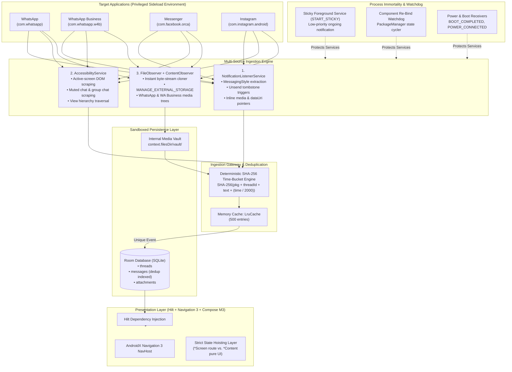

# 🏛️ System Architecture Blueprint: Multi-Source Message & Media Interceptor
*(High-Fidelity Internal Diagnostic & Zero-Data-Loss Logging Tool)*

**Target Platform:** Android 11+ (API Level 30 – 35)  
**Package ID:** `com.example.messagerecovery`  
**Architecture Pattern:** Clean Architecture + MVVM + Unidirectional Data Flow (UDF)  
**DI Framework:** Dagger Hilt (`@HiltAndroidApp`, `@AndroidEntryPoint`, `@HiltViewModel`)  
**Navigation Engine:** AndroidX Navigation 3 (Type-Safe, State-Driven Nav Display)  
**UI & Styling:** Jetpack Compose (Material 3), Compose BOM, Coil 3  
**Database:** Room Database (SQLite with foreign key cascades and unique dedup indices)  
**Target Deployment:** Sideloaded / Internal Debug Build (Zero Google Play Store constraints; aggressive background execution, all-files storage access, accessibility DOM inspection, and maximum data fidelity enabled).

---

## 1. Core Purpose & Target Applications

The system is designed for **100% data capture fidelity and zero data loss**:
1. Intercepting every incoming chat message and multimedia payload.
2. Tracking message deletions and "unsend" events across senders in real time.
3. Immediately cloning media files into a protected sandbox before host applications can unlink them.
4. Preserving conversations even when chats are actively open on-screen or groups are muted.

### Target Applications Matrix
| Application | Package Identifier | Media Storage Paths Monitored |
| :--- | :--- | :--- |
| **WhatsApp** | `com.whatsapp` | `/sdcard/Android/media/com.whatsapp/WhatsApp/Media/` (Images, Video, Audio, Voice Notes, Documents) |
| **WhatsApp Business** | `com.whatsapp.w4b` | `/sdcard/Android/media/com.whatsapp.w4b/WhatsApp Business/Media/` (Images, Video, Audio, Voice Notes, Documents) |
| **Facebook Messenger** | `com.facebook.orca` | `/sdcard/Pictures/Messenger/`, `/sdcard/Movies/Messenger/`, `/sdcard/Download/Messenger/` |
| **Instagram Direct** | `com.instagram.android`| `/sdcard/Pictures/Instagram/`, `/sdcard/Movies/Instagram/` |

---

## 2. High-Level System Architecture



---

## 3. Ingestion Engine Specifications

### 3.1 Primary Interceptor: `NotificationListenerService`
Filters explicitly by:
- `com.whatsapp`
- `com.whatsapp.w4b`
- `com.facebook.orca`
- `com.instagram.android`

#### Extraction Strategy:
- **WhatsApp & WhatsApp Business:**
  Extract `Notification.EXTRA_MESSAGES` into `NotificationCompat.MessagingStyle.Message`. Extract `msg.text`, `msg.person?.name`, `msg.timestamp`, `msg.dataUri`, and `msg.dataMimeType`. If inline bitmap exists, save immediately to vault.
- **Facebook Messenger:**
  Parse `NotificationCompat.MessagingStyle` first; fall back to compound string parsing on `EXTRA_TITLE` and `EXTRA_TEXT`. Check `EXTRA_LARGE_ICON_BIG` or `EXTRA_PICTURE` for inline media bitmaps.
- **Instagram Direct:**
  Parse `EXTRA_TITLE` (sender handle) and `EXTRA_TEXT` (message body). Filter out system/telemetry notices (*"liked a message"*, *"active now"*, *"started a live video"*).

#### Deletion & Unsend Detection Matrix:
| App | Trigger Phrases in Incoming Notification | Action Taken |
| :--- | :--- | :--- |
| **WhatsApp** | `"This message was deleted"`, `"You deleted this message"` | Flag most recent unflagged message in thread as `is_deleted = true`, record `deletion_timestamp`. |
| **WhatsApp Business** | `"This message was deleted"`, `"You deleted this message"` | Flag most recent unflagged message in thread as `is_deleted = true`, record `deletion_timestamp`. |
| **Messenger** | `"unsent a message"`, `"This message was unsent"` | Flag most recent unflagged message in thread as `is_deleted = true`, record `deletion_timestamp`. |
| **Instagram** | `"unsent a message"` | Flag most recent unflagged message in thread as `is_deleted = true`, record `deletion_timestamp`. |

---

### 3.2 Active-Screen & Muted Scraper: `AccessibilityService`
Overcomes the Android OS limitation where notifications are suppressed when a chat is open on screen or a conversation/group is muted.

- **Configuration (`res/xml/accessibility_service_config.xml`):**
  - `canRetrieveWindowContent="true"`
  - `accessibilityEventTypes="typeWindowContentChanged|typeViewScrolled|typeWindowStateChanged"`
  - `packageNames="com.whatsapp,com.whatsapp.w4b,com.facebook.orca,com.instagram.android"`
- **Scraping Algorithm:**
  1. Catch `AccessibilityEvent` on target package.
  2. Inspect `rootInActiveWindow`.
  3. Extract conversation header / contact title node:
     - WhatsApp / WA Business: Target contact title resource or action bar node.
     - Messenger: `thread_title` view node.
     - Instagram: Direct message header handle node.
  4. Traverse child nodes for chat bubbles (`TextView` / `ViewGroup`).
  5. Extract raw text and route to the **Ingestion Gateway** with current timestamp.

---

### 3.3 Media Vault Cloner: `FileObserver` & `ContentObserver`
Provides zero-latency file cloning to prevent media loss when a sender selects "Delete for Everyone" (which normally unlinks the media file from disk).

#### Privileges:
- Full storage access: `android.permission.MANAGE_EXTERNAL_STORAGE` via `Settings.ACTION_MANAGE_APP_ALL_FILES_ACCESS_PERMISSION`.

#### Storage Watch Paths:
```
1. WhatsApp:
   /sdcard/Android/media/com.whatsapp/WhatsApp/Media/WhatsApp Images/
   /sdcard/Android/media/com.whatsapp/WhatsApp/Media/WhatsApp Video/
   /sdcard/Android/media/com.whatsapp/WhatsApp/Media/WhatsApp Audio/
   /sdcard/Android/media/com.whatsapp/WhatsApp/Media/WhatsApp Voice Notes/
   /sdcard/Android/media/com.whatsapp/WhatsApp/Media/WhatsApp Documents/

2. WhatsApp Business:
   /sdcard/Android/media/com.whatsapp.w4b/WhatsApp Business/Media/WhatsApp Business Images/
   /sdcard/Android/media/com.whatsapp.w4b/WhatsApp Business/Media/WhatsApp Business Video/
   /sdcard/Android/media/com.whatsapp.w4b/WhatsApp Business/Media/WhatsApp Business Audio/
   /sdcard/Android/media/com.whatsapp.w4b/WhatsApp Business/Media/WhatsApp Business Voice Notes/
   /sdcard/Android/media/com.whatsapp.w4b/WhatsApp Business/Media/WhatsApp Business Documents/

3. Messenger:
   /sdcard/Pictures/Messenger/
   /sdcard/Movies/Messenger/
   /sdcard/Download/Messenger/

4. Instagram:
   /sdcard/Pictures/Instagram/
   /sdcard/Movies/Instagram/
```

#### Zero-Latency Clone Protocol:
1. Upon `FileObserver.CREATE` or `FileObserver.CLOSE_WRITE`, read the file stream instantly.
2. Clone bytes directly to `context.filesDir.resolve("vault/${packageName}/${UUID}.${extension}")`.
3. Register record in Room DB `attachments` table.
4. If the original file is unlinked by WhatsApp/Messenger unsend routines, the copy in `filesDir/vault/` remains completely preserved.

---

## 4. Ingestion Gateway & Deduplication

All ingestion channels (NotificationListener, Accessibility Scraper, FileObserver) feed into the central deduplicator to prevent duplicate database rows:

$$\text{dedupHash} = \text{SHA-256}\left(\text{packageName} + \text{threadId} + \text{rawText} + \left\lfloor\frac{\text{timestamp}}{2000}\right\rfloor\right)$$

- **Window:** 2-second bucketing.
- **Cache:** In-memory `LruCache<String, Boolean>(500)`.
- **Database:** `messages.dedup_hash` indexed with `UNIQUE` constraint and `OnConflictStrategy.IGNORE`.

---

## 5. Persistence Layer: Room Database

### Entities:
- **`threads`**:
  - `id` (String, PK: e.g. `com.whatsapp_w4b_JohnDoe`)
  - `package_name` (String)
  - `display_name` (String)
  - `avatar_path` (Nullable String)
  - `last_snippet` (Nullable String)
  - `last_timestamp` (Long)
- **`messages`**:
  - `id` (Long, PK, AutoGenerate)
  - `thread_id` (String, FK -> `threads.id` ON DELETE CASCADE)
  - `dedup_hash` (String, UNIQUE indexed)
  - `sender_name` (String)
  - `raw_text` (String)
  - `timestamp` (Long)
  - `is_deleted` (Boolean, default false)
  - `has_attachment` (Boolean, default false)
  - `deletion_timestamp` (Nullable Long)
- **`attachments`**:
  - `id` (Long, PK, AutoGenerate)
  - `message_id` (Nullable Long, FK -> `messages.id` ON DELETE SET NULL)
  - `package_name` (String)
  - `mime_type` (String: `IMAGE`, `VIDEO`, `AUDIO`, `DOCUMENT`)
  - `vault_path` (String)
  - `file_size` (Long)
  - `captured_timestamp` (Long)

---

## 6. Process Immortality & Background Watchdog

Since this is an internal diagnostic tool, maximum reliability is enforced:
1. **Persistent Foreground Service:** `START_STICKY` with `foregroundServiceType="specialUse"` (sub-type: watchdog integrity supervisor) and ongoing low-priority notification (`IMPORTANCE_MIN` / `PRIORITY_MIN`) to avoid Android 15's 6-hour `dataSync` runtime timeout.
2. **Battery Optimization Exemption:** Prompt `Settings.ACTION_REQUEST_IGNORE_BATTERY_OPTIMIZATIONS`.
3. **NotificationListener Re-bind Watchdog:**
   Cycles `PackageManager.COMPONENT_ENABLED_STATE_DISABLED` followed immediately by `COMPONENT_ENABLED_STATE_ENABLED` to force the Android notification manager to re-bind if dropped during deep doze.
4. **Boot & Power Receivers:** Auto-restart on `BOOT_COMPLETED`, `MY_PACKAGE_REPLACED`, `ACTION_POWER_CONNECTED`.

---

## 7. Dependency Injection: Dagger Hilt Architecture

```
@HiltAndroidApp
class MessageRecoveryApp : Application()

@Module
@InstallIn(SingletonComponent::class)
object DatabaseModule {
    @Provides @Singleton fun provideDatabase(@ApplicationContext context: Context): AppDatabase
    @Provides fun provideThreadDao(db: AppDatabase): ThreadDao
    @Provides fun provideMessageDao(db: AppDatabase): MessageDao
    @Provides fun provideAttachmentDao(db: AppDatabase): AttachmentDao
}

@Module
@InstallIn(SingletonComponent::class)
abstract class RepositoryModule {
    @Binds @Singleton abstract fun bindMessageRepository(impl: MessageRepositoryImpl): MessageRepository
    @Binds @Singleton abstract fun bindMediaVaultRepository(impl: MediaVaultRepositoryImpl): MediaVaultRepository
}
```

---

## 8. Navigation Engine: AndroidX Navigation 3

Using **Navigation 3** (`androidx.navigation3`) for state-driven, type-safe screen navigation:

```kotlin
// Navigation 3 Destination Definitions
sealed interface ScreenDestination : NavKey {
    @Serializable data object Onboarding : ScreenDestination
    @Serializable data class ChatList(val filterPackage: String? = null) : ScreenDestination
    @Serializable data class Conversation(val threadId: String) : ScreenDestination
    @Serializable data class AttachmentGallery(val subTab: String = "PHOTOS") : ScreenDestination
}
```

- Navigation backstack is managed via pure Compose state list: `val backStack = rememberNavBackStack(ScreenDestination.ChatList())`.
- Full integration with Hilt: `@HiltViewModel` injected into route-level `*Screen` composables.

---

## 9. Jetpack Compose UI & State Hoisting Rules

All UI components strictly adhere to [.agents/rules/STATE_HOISTING_GUIDELINES.md](file:///d:/Ali%20Data/Message%20Recovery%20App/.agents/rules/STATE_HOISTING_GUIDELINES.md):

1. **Rule 1: Strict Two-Layer Screen Split:**
   - `*Screen` (Stateful Route): Injects `HiltViewModel`, collects `StateFlow`, executes navigation callbacks.
   - `*Content` (Stateless UI): Accepts only immutable UI state and lambda callbacks.
2. **Rule 2: No ViewModels or NavControllers in `*Content` or `@Preview`.**
3. **Rule 3: Zero Business Logic in `*Content`.**
4. **Rule 4: All `@Preview` composables render `*Content` with realistic sample data.**

### UI Layouts & Screens:
- **Top FilterBar:** Horizontal row of Material 3 `FilterChip` components:
  `[ All ]  [ WhatsApp ]  [ WhatsApp Business ]  [ Messenger ]  [ Instagram ]`
- **Bottom Navigation Bar:**
  - `Chats` tab
  - `Attachments` tab
- **ChatListScreen / Content:** LazyColumn of contact threads, origin app badges, unread/deleted indicators, timestamp.
- **ConversationScreen / Content:** Reverse-scrolled LazyColumn.
  - **Deleted Message Bubble:** Error-bordered container (`colorScheme.errorContainer.copy(alpha = 0.25f)`), alert badge with warning icon, notice text: *"Sender unsent this message"*, original preserved message body, and original sent + deletion timestamps.
- **AttachmentGalleryScreen / Content:**
  - Sub-tabs: `Photos`, `Videos`, `Voice Notes`, `Documents`.
  - 3-column `LazyVerticalGrid` powered by Coil (`AsyncImage`) reading directly from `/vault/` paths.
  - Custom audio player bottom sheet for `.opus`, `.m4a`, and `.mp3` voice note playback.

---

## 10. Complete Project Package Directory Structure

```
app/src/main/
├── AndroidManifest.xml
├── res/
│   ├── xml/
│   │   └── accessibility_service_config.xml
│   └── values/
└── java/com/example/messagerecovery/
    ├── MessageRecoveryApp.kt           # @HiltAndroidApp
    ├── MainActivity.kt                 # @AndroidEntryPoint, Nav 3 Entry
    ├── di/                             # DatabaseModule, RepositoryModule
    ├── data/
    │   ├── db/                         # AppDatabase, DAOs, Entities
    │   ├── deduplication/              # DeduplicationEngine (SHA-256 + LruCache)
    │   └── repository/                 # Repository implementations
    ├── domain/
    │   ├── model/                      # Clean domain models
    │   └── repository/                 # Domain repository interfaces
    ├── service/
    │   ├── RecoveryNotificationListener.kt
    │   ├── ScreenScraperAccessibilityService.kt
    │   ├── MediaFileObserverService.kt
    │   ├── WatchdogForegroundService.kt
    │   └── receiver/
    │       └── BootAndStateReceiver.kt
    └── presentation/
        ├── theme/                      # Color, Theme, Type
        ├── navigation/                 # Navigation 3 keys and NavDisplay
        ├── onboarding/                 # OnboardingScreen & OnboardingContent
        ├── chats/                      # ChatListScreen, ConversationScreen & Contents
        └── attachments/                # AttachmentGalleryScreen & Content, AudioPlayer
```

---

## 11. Implementation Phases & Roadmap

| Phase | Milestone | Key Deliverables | Verification Strategy |
| :--- | :--- | :--- | :--- |
| **Phase 1** | **Foundation, Hilt & Navigation 3** | • Hilt dependencies & `@HiltAndroidApp`<br>• Navigation 3 dependency & base router<br>• Theme & Material 3 setup | `./gradlew assembleDebug` compiles cleanly with Hilt code-gen. |
| **Phase 2** | **Persistence & Deduplication Engine** | • Room DB (threads, messages, attachments)<br>• `DeduplicationEngine` (SHA-256 2-second bucketing + LruCache)<br>• Unit tests for deduplication & DAOs | Run `./gradlew test` to ensure 100% test passing on Room & deduplication. |
| **Phase 3** | **Ingestion Engine (3 Pipelines)** | • `NotificationListenerService` (WA, WA Business, Messenger, IG)<br>• `AccessibilityService` DOM scraper<br>• `FileObserver` zero-latency media cloner (`MANAGE_EXTERNAL_STORAGE`) | Live notification & storage triggers; verify DB records & cloned `/vault/` files. |
| **Phase 4** | **Process Immortality & Watchdog** | • Persistent Foreground Service (`START_STICKY`)<br>• Battery optimization exemption request<br>• Component state toggler (auto re-bind watchdog)<br>• Boot & power broadcast receivers | Terminate app via task manager; verify instant restart & listener re-bind. |
| **Phase 5** | **Compose UI (State Hoisting Compliance)** | • Navigation 3 Shell (BottomBar + FilterChips)<br>• `ChatListContent` & `ConversationContent` (Deleted alert bubble styling)<br>• `AttachmentGalleryContent` (Coil media grid & audio player) | All `@Preview` composables render in Android Studio without crashes. |
| **Phase 6** | **End-to-End Live Tuning** | • Live WhatsApp & WhatsApp Business "Delete for everyone" tests<br>• Messenger unsend tests<br>• Audio voice note playback (.opus) | End-to-end verification across all 4 target applications. |
